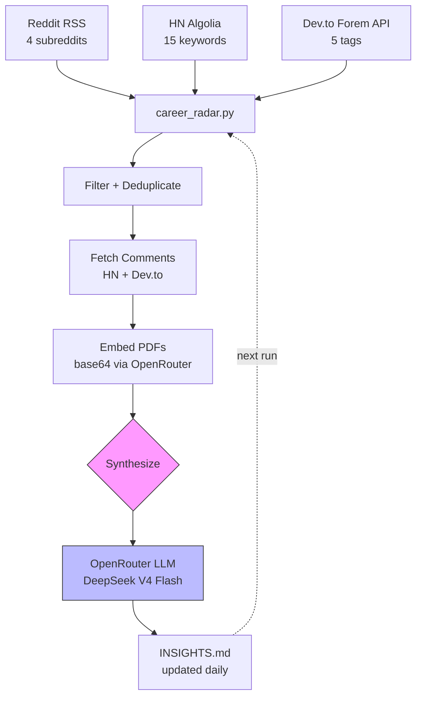

# career-radar

Daily AI-powered career intelligence — personalized, private, free.

Every morning, `career-radar` gathers today's top career-related posts from
Reddit, Hacker News, and Dev.to, grounds them against your locally-stored
resume and CV, and has an LLM rewrite a living markdown document of
actionable career insights tailored specifically to you.

All personalization (API keys, resume/CV paths) lives in gitignored files.
Nothing personal is ever committed — the repo is safe to fork and publish.



## Table of Contents

- [Background](#background)
- [Install](#install)
- [Usage](#usage)
- [Data Sources](#data-sources)
- [How It Works](#how-it-works)
- [Files](#files)
- [Contributing](#contributing)
- [License](#license)

## Background

Most career advice is generic. "Tailor your resume." "Network more."
`career-radar` fixes this by feeding your actual resume, academic CV, and
personal website into an LLM alongside today's real job-market chatter from
Reddit, Hacker News, and Dev.to. Every day it rewrites a living markdown
document of personalized career insights — referencing your specific roles,
technologies, and credentials.

Key design decisions:

- **Zero data-source auth.** Reddit public RSS feeds, HN Algolia API, Dev.to
  Forem API — all work without API keys.
- **PDF-native.** Resumes and CVs sent directly to the LLM as base64-encoded
  PDFs via OpenRouter's file support. No text extraction step.
- **Incremental.** Each run passes the previous `INSIGHTS.md` back to the
  model. It merges new findings, updates stale sections, and logs changes.
- **Output validation.** Post-synthesis checks enforce all 11 required
  sections, correct log date, and sane minimum length. Truncated outputs
  trigger a retry with doubled token budget.

## Install

### Dependencies

- Python 3.11+
- [OpenRouter API key](https://openrouter.ai/keys) (free to create)
- `requests` (only runtime dependency)

No Reddit API app, no HN/Dev.to tokens — data sources are all public.

### Setup

```bash
git clone https://github.com/agopalareddy/career-radar
cd career-radar
python3 -m venv .venv && source .venv/bin/activate
pip install -r requirements.txt
```

### Configure

```bash
cp .env.example .env                  # add your OpenRouter key + resume/CV paths
cp config.example.toml config.toml    # tune subreddits, HN queries, Dev.to tags
```

**`.env`** — add your OpenRouter key and absolute paths to your resume and CV
(PDFs preferred, `.tex` and `.md` also supported):

```bash
OPENROUTER_API_KEY=sk-or-v1-...
CV_PATH=/path/to/resume.pdf,/path/to/cv.pdf
```

**`config.toml`** — customize sources, model, and thresholds:

```toml
model = "deepseek/deepseek-v4-flash"
max_output_tokens = 32768

reddit_subreddits = ["jobsearch", "gradadmissions", "jobsearchhacks", "GetEmployed"]
hn_queries = [
  "resume", "career", "interview", "hiring", "salary",
  "negotiation", "job search", "offer", "layoff",
  "networking", "recruiter", "compensation",
  "cover letter", "career advice", "job market",
]
devto_tags = ["career", "webdev", "beginners", "productivity", "interview"]

min_messages = 25          # skip posts with fewer than N comments
min_posts_to_synthesize = 8  # skip LLM call unless N+ active posts collected
```

## Usage

```bash
python3 test_career_radar.py           # offline self-checks (no deps)
python3 career_radar.py --dry-run      # fetch + print digest, skip LLM
python3 career_radar.py                # full run → data/INSIGHTS.md
```

### Scheduling

**cron (recommended)**

```cron
0 8 * * * cd /path/to/career-radar && .venv/bin/python career_radar.py >> data/run.log 2>&1
```

**systemd user timer**

`~/.config/systemd/user/career-radar.service`:

```ini
[Unit]
Description=career-radar daily run

[Service]
Type=oneshot
WorkingDirectory=/path/to/career-radar
ExecStart=/path/to/career-radar/.venv/bin/python career_radar.py
```

`~/.config/systemd/user/career-radar.timer`:

```ini
[Unit]
Description=career-radar daily timer

[Timer]
OnCalendar=*-*-* 08:15
Persistent=true

[Install]
WantedBy=timers.target
```

```bash
systemctl --user enable --now career-radar.timer
```

## Data Sources

| Source      | Method                        | Auth | Comments                     |
| ----------- | ----------------------------- | ---- | ---------------------------- |
| Reddit      | Public RSS feeds (`/top.rss`) | None | Posts + comment counts       |
| Hacker News | Algolia Search API            | None | Posts + comment trees        |
| Dev.to      | Forem API v0                  | None | Articles + threaded comments |

Comments are extracted for HN and Dev.to posts. Reddit RSS provides post
titles, full self-text, and comment counts (parsed from the RSS footer).

## How It Works

1. **Fetch** — Reddit RSS (4 subreddits, ~40 posts), HN Algolia (15 keywords,
   ~75 posts), Dev.to (5 tags, ~25 articles).
2. **Filter** — Deduplicate against `data/seen.json` (last 3,000 post IDs).
   Drop posts below `min_messages` threshold (default 25 comments) without
   marking them seen — they stay available for future runs.
3. **Gate** — If fewer than `min_posts_to_synthesize` active posts remain,
   skip the LLM call entirely.
4. **Comment** — Fetch top comments for highest-scoring HN and Dev.to posts.
5. **Embed** — Encode resume + CV PDFs as base64 and attach to the LLM request.
6. **Synthesize** — Send the full digest + profile + previous INSIGHTS.md to
   OpenRouter. The LLM rewrites the entire document — merging new findings,
   updating stale sections, and logging changes.
7. **Validate** — Check output for all 11 required sections, correct log date,
   and minimum length. Retry once with doubled token budget if truncated.
8. **Save** — Write updated `data/INSIGHTS.md` and `data/seen.json`. Errors
   from any source go to `data/errors.log`.

## Files

| File                   | Committed     | Purpose                       |
| ---------------------- | ------------- | ----------------------------- |
| `career_radar.py`      | ✅            | Multi-source pipeline          |
| `config.example.toml`  | ✅            | Config template                |
| `.env.example`         | ✅            | Env template                   |
| `test_career_radar.py` | ✅            | 7 offline self-checks          |
| `requirements.txt`     | ✅            | Python dependencies            |
| `config.toml` / `.env` | ❌ gitignored | Your personalization           |
| `data/`                | ❌ gitignored | INSIGHTS.md, seen.json, errors |

## Contributing

Bug reports and feature requests welcome via [GitHub
Issues](https://github.com/agopalareddy/career-radar/issues). PRs should
keep the dependency footprint minimal — the only runtime dependency is
`requests`.

1. Fork the repo
2. Create a feature branch (`git checkout -b feat/amazing-feature`)
3. Run tests (`python3 test_career_radar.py`)
4. Run a dry-run (`python3 career_radar.py --dry-run`)
5. Open a PR

## License

[MIT](LICENSE) © Aadarsha Gopala Reddy
