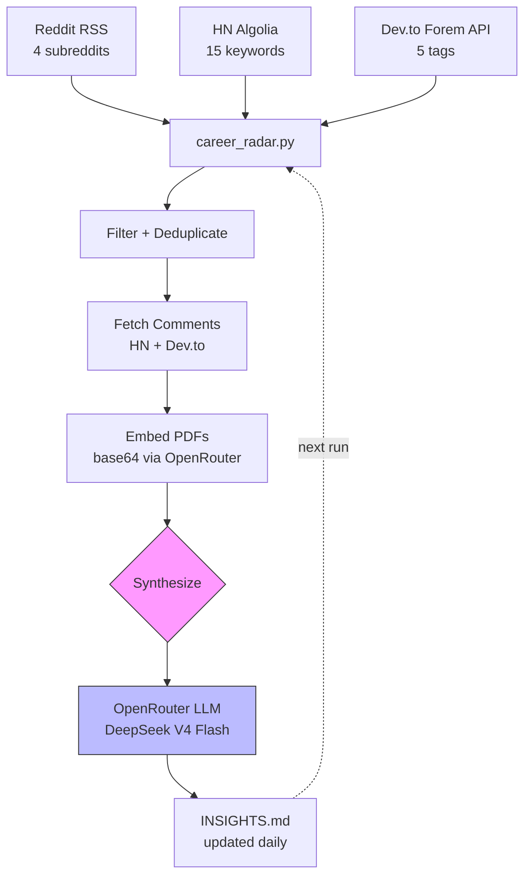

# career-radar

**Daily AI-powered career intelligence — personalized, private, free.**

Every morning, `career-radar` gathers today's top career-related posts from
Reddit, Hacker News, and Dev.to, grounds them against your locally-stored
resume and CV, and has an LLM rewrite a living markdown document of
actionable career insights tailored specifically to you.



All personalization (API keys, resume/CV paths) lives in gitignored files.
Nothing personal is ever committed — the repo is safe to fork and publish.

## Features

- **Three free data sources** — Reddit RSS (no auth), Hacker News Algolia API,
  Dev.to Forem API. Zero API keys required for data collection.
- **PDF-native parsing** — Resumes and CVs sent directly to the LLM via
  OpenRouter's file support. No `pdftotext` needed.
- **Comment extraction** — Comments fetched for HN and Dev.to posts for deeper
  signal.
- **Incremental updates** — Each run passes the previous `INSIGHTS.md` back to
  the model so it merges, updates, and drops stale advice.
- **Deduplication** — Post IDs tracked in `data/seen.json`; nothing processed
  twice.
- **~$0.01/day** — Default model is `deepseek/deepseek-v4-flash` via OpenRouter
  ($0.09/M input, $0.18/M output).

## Requirements

- Python 3.11+
- An [OpenRouter API key](https://openrouter.ai/keys) (free to create)
- No Reddit API app needed — uses public RSS feeds

## Quick Start

```bash
git clone https://github.com/agopalareddy/career-radar
cd career-radar
python3 -m venv .venv && source .venv/bin/activate
pip install -r requirements.txt
```

### Configure

```bash
cp .env.example .env                  # add your OpenRouter key + resume/CV paths
cp config.example.toml config.toml    # tune subreddits, HN queries, Dev.to tags
```

**`.env`** — add your OpenRouter key and absolute paths to your resume and CV
(PDFs preferred, `.tex` and `.md` also supported):

```bash
OPENROUTER_API_KEY=sk-or-v1-...
CV_PATH=/path/to/resume.pdf,/path/to/cv.pdf
```

**`config.toml`** — customize subreddits, HN search queries, and Dev.to tags
for your field:

```toml
reddit_subreddits = ["jobsearch", "gradadmissions", "jobsearchhacks", "GetEmployed"]
hn_queries = [
  "resume", "career", "interview", "hiring", "salary",
  "negotiation", "job search", "offer", "layoff",
  "networking", "recruiter", "compensation",
  "cover letter", "career advice", "job market",
]
devto_tags = ["career", "webdev", "beginners", "productivity", "interview"]
```

### Run

```bash
python3 test_career_radar.py           # 4 offline self-checks (no deps)
python3 career_radar.py --dry-run      # fetch + print digest, skip LLM
python3 career_radar.py                # full run → data/INSIGHTS.md
```

## Scheduling

### cron (recommended)

```cron
0 8 * * * cd /path/to/career-radar && .venv/bin/python career_radar.py >> data/run.log 2>&1
```

### systemd user timer

`~/.config/systemd/user/career-radar.service`:

```ini
[Unit]
Description=career-radar daily run

[Service]
Type=oneshot
WorkingDirectory=/path/to/career-radar
ExecStart=/path/to/career-radar/.venv/bin/python career_radar.py
```

`~/.config/systemd/user/career-radar.timer`:

```ini
[Unit]
Description=career-radar daily timer

[Timer]
OnCalendar=*-*-* 08:15
Persistent=true

[Install]
WantedBy=timers.target
```

```bash
systemctl --user enable --now career-radar.timer
```

## Data Sources

| Source      | Method                        | Auth | Comments                     |
| ----------- | ----------------------------- | ---- | ---------------------------- |
| Reddit      | Public RSS feeds (`/top.rss`) | None | Posts only                   |
| Hacker News | Algolia Search API            | None | Posts + comment trees        |
| Dev.to      | Forem API v0                  | None | Articles + threaded comments |

Comments are extracted for HN and Dev.to. Reddit RSS provides post titles
and full self-text but does not include comment data.

## How It Works

1. **Fetch** — Reddit RSS (4 subreddits, ~40 posts), HN Algolia (15 keywords,
   ~75 posts), Dev.to (5 tags, ~25 articles).
2. **Filter** — Deduplicate against `data/seen.json` (last 3,000 post IDs).
3. **Comment** — Fetch top comments for highest-scoring HN and Dev.to posts.
4. **Embed** — Encode resume + CV PDFs as base64 and attach to the LLM request.
5. **Synthesize** — Send the full digest + profile + previous INSIGHTS.md to
   OpenRouter. The LLM rewrites the entire document — merging new findings,
   updating stale sections, and logging changes.
6. **Save** — Write updated `data/INSIGHTS.md` and `data/seen.json`.

## Files

| File                   | Committed     | Purpose                            |
| ---------------------- | ------------- | ---------------------------------- |
| `career_radar.py`      | ✅            | Multi-source pipeline (~550 lines) |
| `config.example.toml`  | ✅            | Config template                    |
| `.env.example`         | ✅            | Env template                       |
| `test_career_radar.py` | ✅            | 4 offline self-checks              |
| `config.toml` / `.env` | ❌ gitignored | Your personalization               |
| `data/`                | ❌ gitignored | INSIGHTS.md, seen.json, logs       |

## Contributing

Bug reports and feature requests welcome via GitHub Issues. PRs should keep
the dependency footprint minimal — the only runtime dependency is `requests`.

1. Fork the repo
2. Create a feature branch (`git checkout -b feat/amazing-feature`)
3. Run tests (`python3 test_career_radar.py`)
4. Run a dry-run (`python3 career_radar.py --dry-run`)
5. Open a PR

## License

MIT — see [LICENSE](LICENSE).
